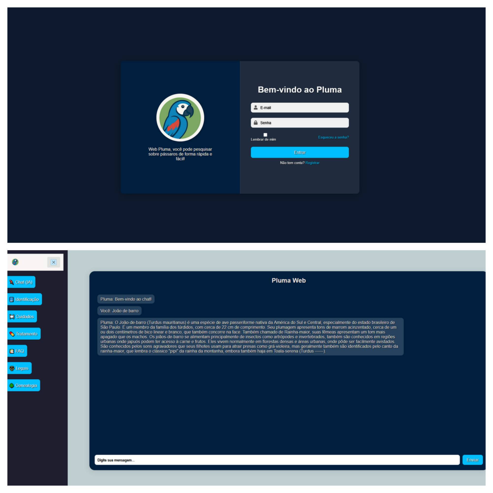

# 🪶 Pluma

**Pluma** é um assistente virtual com inteligência artificial voltado para orientação e cuidados com aves. 
Ele oferece informações úteis sobre espécies, fichas de nascimento e cuidados gerais, podendo ser integrado a plataformas como openrouter.ai.

## 📌 Funcionalidades

- 🔍 Guia de Espécies
- 💬 Integração com o Openrouter para automação
- 🌐  Interface amigável e responsiva com React
- ⚙️ Backend escalável com Node.js 
- 🔨 Implementação da bibliteca axios

## 🚀 Tecnologias Utilizadas

### Frontend

- [React](https://reactjs.org/)
- [Vite](https://vitejs.dev/)
- CSS3 e HTML
- Axios (para requisições API)

### Backend

- **Node.js + Express** (Javascript)**
- Openrouter.ai
- MongoDB 
- Prisma

📸 Demonstração



## 🛠️ Instalação

### 1. Clone o repositório

```bash
git clone https://github.com/AlexadraCampos/pluma
cd pluma

# React + Vite


